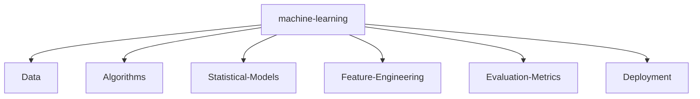

<!--
**devguru99/devguru99** is a ✨ _special_ ✨ repository because its `README.md` (this file) appears on your GitHub profile.

Here are some ideas to get you started:

- 🔭 I’m currently working on ...
- 🌱 I’m currently learning ...
- 👯 I’m looking to collaborate on ...
- 🤔 I’m looking for help with ...
- 💬 Ask me about ...
- 📫 How to reach me: ...
- 😄 Pronouns: ...
- ⚡ Fun fact: ...
-->


#  Hello! I'm Dmytro Mishenkov

<p align="center">
You have stayed on my page for:
</p>

<p align="center">
<a href="https://github.com/tomchen/animated-svg-clock" title="Animated SVG clock"></a>
</p>

<p>
    <a href="https://github.com/devguru99/devguru99"></a>
    <a href="https://github.com/devguru99/devguru99/graphs/contributors"></a>
    <a href="https://github.com/devguru99/devguru99/stargazers"></a>
    <a href="https://github.com/devguru99/devguru99/network/members"></a>
       
</p>

I am 🧙 Senior Software Engineer / Web designer (IT Consultant) and 🏆 Open Source lover

_I am open to new opportunities/contributions._

* <span title="I use">🧰</span>: <a href="https://www.typescriptlang.org/" title="Typescript"></a>
<a href="https://developer.mozilla.org/en-US/docs/Web/JavaScript" title="JavaScript"></a>
<a href="https://tc39.es/ecma262/" title="ECMAScript 6"></a>
<a href="https://reactjs.org/" title="React"></a>
<a href="https://redux.js.org/" title="Redux"></a>
<a href="https://vuejs.org/" title="Vue.js"></a>
<a href="https://angular.io/" title="Angular"></a>
<a href="https://svelte.dev/" title="Svelte"></a>
<a href="https://rxjs.dev/" title="RxJS"></a>
<a href="https://github.com/redux-observable/redux-observable" title="redux-observable"></a>
<a href="https://d3js.org/" title="D3"></a>
<a href="https://greensock.com/gsap/" title="GSAP"></a>
<a href="https://www.webrtc.org/" title="WebRTC"></a>
<a href="https://developers.google.com/web/tools/workbox" title="Workbox"></a>
<a href="https://jquery.com/" title="jQuery"></a>
<a href="https://www.w3.org/TR/CSS/" title="CSS3"></a>
<a href="https://sass-lang.com/" title="Sass"></a>
<a href="https://tailwindcss.com/" title="Tailwind CSS"></a>
<a href="https://material-ui.com/" title="Material UI"></a>
<a href="https://ant.design/" title="Ant Design"></a>
<a href="https://getbootstrap.com/" title="Bootstrap"></a>
<a href="https://www.w3.org/TR/html5/" title="HTML5"></a>
<a href="https://nodejs.org/" title="Node.js"></a>
<a href="https://expressjs.com/" title="Express"></a>
<a href="https://zeit.co/next" title="Next.js"></a>
<a href="https://electron.atom.io/" title="Electron"></a>
<a href="https://php.net/" title="PHP"></a>
<a href="https://laravel.com/" title="Laravel"></a>
<a href="https://www.java.com/" title="Java"></a>
<a href="https://spring.io/" title="Spring"></a>
<a href="https://www.python.org/" title="Python"></a>
<a href="https://pandas.pydata.org/" title="pandas"></a>
<a href="https://numpy.org/" title="NumPY"></a>
<a href="https://www.mongodb.org/" title="MongoDB"></a>
<a href="https://dev.mysql.com/" title="MySQL"></a>
<a href="https://www.postgresql.org/" title="PostgreSQL"></a>
<a href="https://graphql.org/" title="GraphQL"></a>
<a href="https://www.apollographql.com/" title="Apollo"></a>
<a href="https://git-scm.com/" title="Git"></a>
<a href="https://subversion.apache.org/" title="Subversion"></a>
<a href="https://www.npmjs.com/" title="npm"></a>
<a href="https://yarnpkg.com/" title="Yarn"></a>
<a href="https://webpack.js.org/" title="webpack"></a>
<a href="https://gulpjs.com/" title="gulp"></a>
<a href="https://rollupjs.org/" title="rollup.js"></a>
<a href="https://vitejs.dev/" title="Vite"></a>
<a href="https://www.snowpack.dev/" title="Snowpack"></a>
<a href="https://babeljs.io/" title="Babel"></a>
<a href="https://handlebarsjs.com/" title="Handlebars"></a>
<a href="https://eslint.org/" title="ESLint"></a>
<a href="https://prettier.io/" title="Prettier"></a>
<a href="https://jestjs.io/" title="Jest"></a>
<a href="https://github.com/enzymejs/enzyme" title="Enzyme"></a>
<a href="https://www.cypress.io/" title="Cypress"></a>
<a href="https://nightwatchjs.org/" title="Nightwatch.js"></a>
<a href="https://circleci.com/" title="CircleCI"></a>
<a href="https://codecov.io/" title="Codecov"></a>
<a href="https://code.visualstudio.com/" title="Visual Studio Code"></a>
<a href="https://www.sublimetext.com/" title="Sublime Text"></a>
<a href="https://www.gatsbyjs.com/" title="Gatsby"></a>
<a href="https://gohugo.io/" title="Hugo"></a>
<a href="https://wordpress.org/" title="WordPress"></a>
<a href="https://www.apache.org/" title="Apache"></a>
<a href="https://aws.amazon.com/" title="AWS"></a>
<a href="https://azure.microsoft.com/" title="Microsoft Azure"></a>
<a href="https://www.firebase.com/" title="Firebase"></a>
<a href="https://www.elastic.co/products/elasticsearch" title="Elasticsearch"></a>
<a href="https://www.cloudflare.com/" title="Cloudflare"></a>
<a href="https://openid.net/" title="OpenID"></a>
<a href="https://deno.land/" title="Deno"></a>
<a href="https://www.docker.com/" title="docker"></a>
<a href="https://reactnative.dev/" title="React Native"></a>
<a href="https://www.embarcadero.com/products/delphi" title="Delphi"></a>
<a href="https://en.wikipedia.org/wiki/C_(programming_language)" title="C"></a>
<a href="https://isocpp.org/" title="C++"></a>
<a href="https://www.r-project.org/" title="R"></a>
<a href="https://nsis.sourceforge.io/" title="NSIS"></a>
<a href="https://www.adobe.com/products/photoshop.html" title="Adobe Photoshop"></a>
<a href="https://www.adobe.com/products/illustrator.html" title="Adobe Illustrator"></a>
<a href="https://inkscape.org/" title="Inkscape"></a> ([geticon](https://github.com/get-icon/geticon "Get Icon Project"))
* <span title="I like">❤️</span>: <span title="programming">💻</span> <span title="photography">📷</span> <span title="traveling">🚗</span> <span title="jogging">🏃</span> <span title="melody writing">🎵</span> <span title="good UX and UI">🌻</span>

<p align="center">
(move your mouse over the text/icons to view explanation)
</p>

## Github stats:

<p align="center">
    <a href="https://github.com/devguru99">
      
    </a>
    <a href="https://github.com/devguru99">
      
    </a>
</p>

---

## Personal stats:

#### Skilled in JavaScript frameworks like React, Vue, Svelte, Stencil, and Angular, and proficient with back-end technologies such as Node, Go, and Rust, this role focuses on creating scalable, efficient, and secure applications.

<details>
  <summary>Highlights / Proficiencies / Interests / Believes</summary>

Highlights:

- ⭐ 5+ years of professional experience in full lifecycle development
- ⭐ Delivered over 25+ projects
- ⭐ Worked with over 7+ companies from startup to enterprise level
- ⭐ Worked on innovative and cutting-edge projects
- ⭐ Contribute to industry thought leadership
- ⭐ Contribute to open-source and private source
- ⭐ Master new technologies, master computer science and mathematics

Proficiencies:

- 📚 JavaScript, TypeScript, Node.js with Serverless and Containers and Microservices architecture
- 📚 React.js + Next.js + SSR/CSR + Prisma + Vercel + Strapi
- 📚 Vue.js + Nuxt.js + SSR/CSR + TypeOrm + Cloudflare + Laravel
- 📚 Angular, RxJS, NgRx
- 📚 Svelte and Stencil + Storybook + Web Components
- 📚 SQL and NoSQL databases (MySQL, PostgreSQL, MongoDB, DynamoDB, Redis)
- 📚 AWS, Azure and GCP
- 📚 Go lang, Move lang, Rust
- 📚 HTML5/CSS3 + Canvas + WebGL + Animation
- 📚 Agile, Scrum, Kanban
- 📚 Interested in Cryptography (cryptocurrency and blockchain)
- 📚 Project Leadership


Big believer in:

- 💡 Power of continuous learning and personal growth
- 💡 Importance of cultivating a positive mindset and embracing optimism
- 💡 Value of hard work and perseverance in achieving success
- 💡 Power of empathy and kindness in fostering meaningful connections and creating a harmonious society
- 💡 Importance of ethical behavior and integrity in all aspects of life

</details>

---

## Thanks for visiting

<p align="center"> 


---


<div align="center">
<summary>Trophy: Github Profile Trophy</summary>
</div>

<p align="center"> 
<a href="https://github.com/ryo-ma/github-profile-trophy"></a>
</p>

   <!--machine-learning-->




### Profile Views

counting of visitors to this page in this section started from June 12, 2022


</br>

[MIT](LICENSE)

---

## 🚦 Profile Traffic

  <!-- <p align="left">  </p> -->

<!--  -->


<!-- ## 🚀 Developer Activity

  <picture align="center">
    <source media="(prefers-color-scheme: dark)" srcset="https://streak-stats.demolab.com?user=devguru99&theme=vision-friendly-dark&hide_border=true&date_format=j%20M%5B%20Y%5D" />
    <source media="(prefers-color-scheme: light)" srcset="https://streak-stats.demolab.com?user=devguru99&theme=buefy&hide_border=true&date_format=j%20M%5B%20Y%5D&currStreakNum=FFB000&currStreakLabel=FFB000" />
    
  </picture>

<picture>
  <source media="(prefers-color-scheme: dark)" srcset="https://raw.githubusercontent.com/devguru99/devguru99/output/github-snake-dark.svg" />
  <source media="(prefers-color-scheme: light)" srcset="https://raw.githubusercontent.com/devguru99/devguru99/output/github-snake.svg" />
  
</picture>

<picture>
  <source media="(prefers-color-scheme: dark)" srcset="https://raw.githubusercontent.com/devguru99/devguru99/dsaStats/dsa-stats.svg" />
  <source media="(prefers-color-scheme: light)" srcset="https://raw.githubusercontent.com/devguru99/devguru99/dsaStats/dsa-stats.svg" />
  
</picture>
-->
#### Icons with Animation:

<div style="display: flex; align-items: flex-start; align: center">
<table align="center">
  <tr>
    <td align="center" width="96">
        
      <br>React
    </td>
    <td align="center" width="96">
      <a href="#macropower-tech">
        
      </a>
      <br>Python
    </td>
    <td align="center" width="96">
        
      <br>JavaScript
    </td>
    <td align="center" width="96">
        
      <br>Swift
    </td>
    <td align="center" width="96">
        
      <br>Solidity
    </td>
  </tr>
  <tr>
    <td align="center" width="96">
        
      <br>MySQL
    </td>
    <td align="center" width="96">
        
      <br>MongoDB
    </td>
    <td align="center" width="96">
        
      <br>PostgreSQL
    </td>
    <td align="center"  width="96">
        
      <br>Bootstrap
    </td>
    <td align="center" width="96">
        
      <br>Tailwind
    </td>  
  </tr>
  <tr>
    <td align="center" width="96">
        
      <br>Flask
    </td>
    <td align="center" width="96">
        
      <br>Django
    </td>
    <td align="center" width="96">
        
      <br>Vite
    </td>
    <td align="center" width="96">
        
      <br>Vitest
    </td>
    <td align="center" width="96">
        
      <br>Nodejs
    </td>
  </tr>
  <tr>
    <td align="center" width="96">
        
      <br>Github
    </td>
    <td align="center" width="96">
        
      <br>P5.js
    </td>
    <td align="center" width="96">
        
      <br>Blender
    </td>
    <td align="center" width="96">
        
      <br>Figma
    </td>
    <td align="center" width="96">
        
      <br>Three.js
    </td>
  </tr>
</table>
---

## _If you liked my profile, you can Star ⭐ the repo and if you want to use this template you can Fork it and can use._

Would you like to meet me?

If you want to contribute to any of my repositories, feel free to submit PRs, issues and email me. Pick a slot if you'd like to meet me and chat about proposals and ideas - but make sure to describe the agenda

---


```TypeScript
// Check if the code is functioning correctly

// Let's ensure the code is the epitome of excellence
if (isCodeWorking) {
    console.log("✨ Code works! Time to polish it until it shines.");
    // Perfection is our destination, so onward we go!
    while (codeQuality < perfection) {
        codeQuality++; // Increment the code quality score
        console.log(`Improving... Code quality now at ${codeQuality}.`);
    }
    console.log("🏆 Code has reached perfection!");
}

// The cycle of life: eat, sleep, repeat
while (alive) {
    eat();
    sleep();
    console.log("Repeat! Because life is a loop. 🍕💤🔁");
}

// - Dmytro Mishenkov
```
